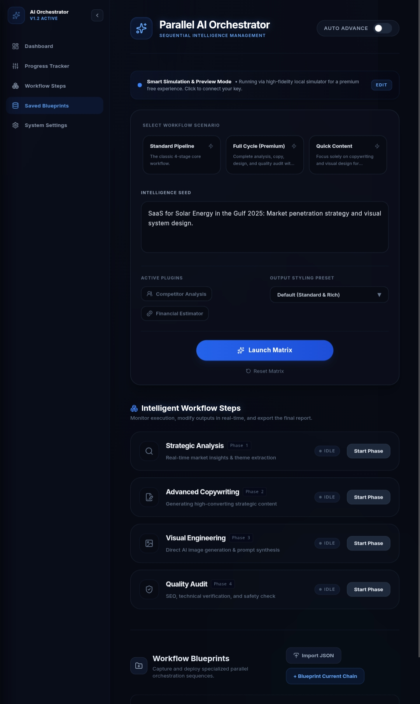

# ⚡ AI Prompt Orchestrator | أوركسترا التوجيهات الذكية

<div align="center">


<br />

**منصة متقدمة لسلسلة وتنسيق التوجيهات الذكية وتوليد الأفكار الاستراتيجية المتوازية والتعاقبية المدعومة بنماذج Gemini**

*An advanced sequential & parallel intelligence chaining platform that deconstructs complex creative and strategic tasks into rigorous multi-phase pipelines using Google Gemini models.*

<br />

---

### 📱 معاينة التطبيق | Application Preview

<p align="center">
  
</p>

<p align="center">
  <sub>🔗 <a href="https://drive.google.com/file/d/14gl7kI4KcAv_CWm-1_ONggelUm6-X5gm/view?usp=drivesdk" target="_blank">رابط معاينة الصورة على Google Drive</a></sub>
</p>

---

</div>

<br />

## 🌟 نظرة عامة | Overview

**AI Prompt Orchestrator** هو نظام هندسة وتوجيه متعدد المراحل يقوم بتفكيك أي فكرة أو بذرة مشروع إلى مسار متسلسل ومتكامل من الذكاء الاصطناعي. بدلاً من الاعتماد على توجيه واحد غامض، يمرر النظام مخرجات كل مرحلة إلى المرحلة التي تليها كسياق ديناميكي، مما يضمن أعلى درجات الاتساق والدقة والعمق في النتائج.

يعمل النظام بتناغم كامل بين واجهة مستخدم مظلمة فائقة الحداثة (Dark Theme with Cyberpunk Glow) وخادم خلفي مؤمّن ومبني بواسطة Express للربط مع حزمة `@google/genai` الرسمية، مع وجود محرك محاكاة داخلي ذكي يعمل في حالة غياب مفتاح الربط.

---

## 🚀 المميزات الرئيسية | Key Features

### 1. 🔄 خطوط الإنتاج التعاقبية والمتوازية (Sequential & Parallel Pipelines)
- **التحليل الاستراتيجي الأولي (Strategic Preliminary Analysis):** تفكيك السوق والفرص ونقاط القوة والضعف وتحديد الجمهور المستهدف.
- **الصياغة التسويقية المقنعة (High-Impact Copywriting):** كتابة نصوص بيع وإعلانات احترافية مبنية على نتائج التحليل الاستراتيجي.
- **توليد السيناريو والمشهد البصري (Visual Narrative & Storyboard):** صياغة وصف المشاهد واللقطات والإضاءة ولوحات الإلهام البصرية.
- **تدقيق الجودة والملاءمة الشامل (Comprehensive Quality & Safety Audit):** فحص عميق للنبرة والأصالة ومطابقة المعايير وإجراء التحسينات الدقيقة.
- **تحليل المنافسين ومكامن القوة (Competitor Benchmarking):** رصد استراتيجيات السوق واقتناص الثغرات التنافسية.
- **دراسة الجدوى والربحية (Financial Feasibility):** تقدير نماذج التسعير، تكاليف التشغيل ومسارات تحقيق الإيرادات.

### 2. ⚡ سيناريوهات وقوالب العمل الجاهزة (Workflow Scenarios)
- **مسار إطلاق المنتجات (Product Launch):** تحليل استراتيجي -> صياغة تسويقية -> مراجعة شاملة.
- **الحملات التسويقية المتكاملة (Growth Marketing Campaign):** نصوص إعلانية -> سيناريو مرئي -> تدقيق وتأكيد الجودة.
- **دراسة الجدوى الاستثمارية (Full Feasibility & Strategy):** تحليل استراتيجي -> مقارنة المنافسين -> دراسة الجدوى المالية.

### 3. 📄 مركز تصدير التقارير الاستراتيجية (Export Center)
- **تصدير ملف PDF احترافي ومباشر:** تصدير وثيقة متكاملة بصيغة PDF فور اكتمال مرحلة التدقيق باستخدام مكتبة `jspdf`.
- **تصدير Markdown و JSON:** لتسهيل مشاركة النتائج مع فرق التطوير وإدارات المشاريع.

### 4. 🎛️ خيارات وتخصيصات متقدمة (Advanced Control Hub)
- **أنماط الصياغة المخصصة (Formatting Presets):**
  - النمط الأكاديمي المفصل (Detailed Academic).
  - النمط التنفيذي الموجز (Executive Brief).
  - النمط التسويقي الحماسي (High-Conversion Marketing).
  - النمط الفني التقني (Technical Spec).
- **منظومة الإضافات الذكية (Intelligent Plugins):**
  - محاكاة البحث المباشر (Search Grounding).
  - مدقق الحقائق والبيانات (Fact-Check Engine).
  - بيئة تشغيل الكود وفحصه (Code Sandbox).
  - مقياس النبرة والمشاعر (Sentiment Calibrator).
  - فاحص الاتساق الداخلي (Cross-Check Consistency).

### 5. 📊 سجل الأحداث والعمليات اللحظي (Execution & Event Intelligence Log)
- شاشة مراقبة لحظية تسجل كل حدث، وقت البدء، الاستجابة، وحالة الأنابيب التعاقبية لسهولة التتبع والتشخيص.

### 6. 💾 مكتبة المخططات والحفظ التلقائي (Blueprint Snapshot Library)
- إمكانية حفظ المشاريع والمصفوفات واسترجاعها وتصديرها واستيرادها بنقرة واحدة عبر التخزين المحلي الآمن `localStorage`.

### 7. 🌐 دعم كامل للغتين (Arabic RTL & English LTR)
- تبديل فوري وسلس بين واجهة المستخدم باللغة العربية مع اتجاه القراءة الطبيعي (Right-to-Left)، واللغة الإنجليزية (Left-to-Right) دون أي تشوه في التنسيق.

---

## 🛠️ التقنيات المستخدمة | Tech Stack

| المجال | التقنية | الغرض |
|---|---|---|
| **الواجهة الأمامية** | React 19 + TypeScript | بنية تفاعلية حديثة وخالية من الأخطاء |
| **التنسيق والتصميم** | Tailwind CSS 3.4 | تصميم داكن متناسق مع تأثيرات نيون راقية |
| **الحركات والانتقالات** | Motion (Framer Motion) | سلاسة في فتح النوافذ والبطاقات وسير العمل |
| **الأيقونات** | Lucide React | حزمة أيقونات متجهة عالية الدقة وموحدة |
| **الخادم والواجهات** | Node.js + Express 5 | إدارة نقاط النهاية وحماية مفاتيح الـ API |
| **الذكاء الاصطناعي** | `@google/genai` (Gemini Flash) | توليد المحتوى وتحليل السلاسل الاستراتيجية |
| **تصدير التقارير** | jsPDF | توليد مستندات PDF استراتيجية قابلة للطباعة |
| **الحزم والبناء** | Vite 5 + esbuild | بناء وتجميع سريع وفائق الاستجابة |

---

## 📂 هيكل المشروع | Project Structure

```text
ai-prompt-orchestrator/
├── docs/
│   └── preview.jpg                # صورة المعاينة المرفقة للمشروع
├── public/
│   └── preview.jpg                # نسخة متاحة للعرض المباشر
├── src/
│   ├── components/                # مكونات الواجهة العامة (Nav, Modals, Toasts)
│   ├── features/
│   │   └── orchestrator/          # مكونات الأوركسترا الرئيسية
│   │       ├── components/        # بطاقات المراحل (StepNode)، أشرطة التحكم
│   │       │   ├── ParallelOrchestrator.tsx
│   │       │   └── StepNode.tsx
│   │       └── ...
│   ├── hooks/                     # خطافات إدارة الحالة وتدفق العمل
│   │   ├── useOrchestratorState.ts
│   │   └── useLibraryState.ts
│   ├── lib/
│   │   ├── api/                   # دوال استدعاء وتوليد الذكاء الاصطناعي
│   │   ├── i18n/                  # ملفات الترجمة الكاملة (عربي / إنجليزي)
│   │   ├── storage/               # إدارة حفظ المخططات (Blueprints)
│   │   └── constants.ts           # الثوابت والقوالب والمصفوفات
│   ├── types/                     # واجهات وأنواع TypeScript
│   ├── App.tsx                    # نقطة الدخول الرئيسية للتطبيق
│   └── main.tsx
├── server.ts                      # خادم Express ومسار الذكاء الاصطناعي /api/run-step
├── package.json
├── tsconfig.json
├── vite.config.ts
├── metadata.json
└── README.md
```

---

## ⚙️ متطلبات التشغيل والتثبيت | Getting Started

### 1. المتطلبات الأساسية
- تثبيت **Node.js** (الإصدار 18 أو أحدث).
- مدير حزم مثل **npm** أو **pnpm** أو **yarn**.
- (اختياري) مفتاح **Google Gemini API Key** لتفعيل التوليد المباشر من نماذج Google السحابية.

### 2. تثبيت الحزم
```bash
npm install
```

### 3. ضبط متغيرات البيئة (اختياري)
أنشئ ملف `.env` في المجلد الرئيسي (أو اعتمد على محرك المحاكاة التلقائي):
```env
GEMINI_API_KEY=your_google_gemini_api_key_here
```

### 4. تشغيل خادم التطوير
```bash
npm run dev
```
افتح المتصفح وتوجه إلى الرابط:
```
http://localhost:3000
```

### 5. البناء للإنتاج (Production Build)
```bash
npm run build
npm start
```

---

## 🛡️ الأمان والخصوصية | Security & Privacy

- **حماية مفاتيح API:** جميع اتصالات نماذج Gemini تتم حصرياً عبر الخادم الخلفي (`server.ts`) دون تسريب أي مفاتيح لواجهة المتصفح.
- **التخزين المحلي الآمن:** تُحفظ جميع المشاريع والمخططات في ذاكرة المتصفح الخاصة بالمستخدم دون مشاركتها خارج بيئة العمل.

---

## 📄 الترخيص | License

هذا المشروع متاح للاستخدام والتطوير بموجب رخصة **MIT**.

---

<div align="center">
  <b>تم التصميم والتطوير بكل فخر بواسطة أدوات Google AI Studio ومجتمع المطورين 🚀</b>
</div>
